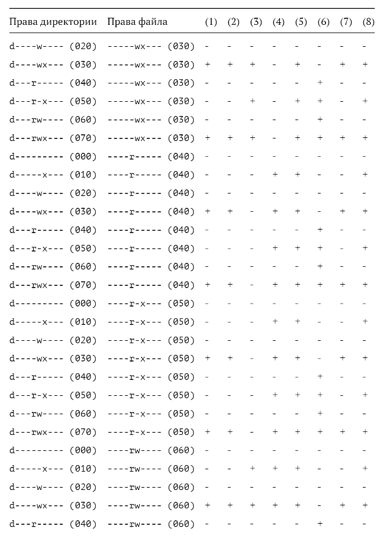
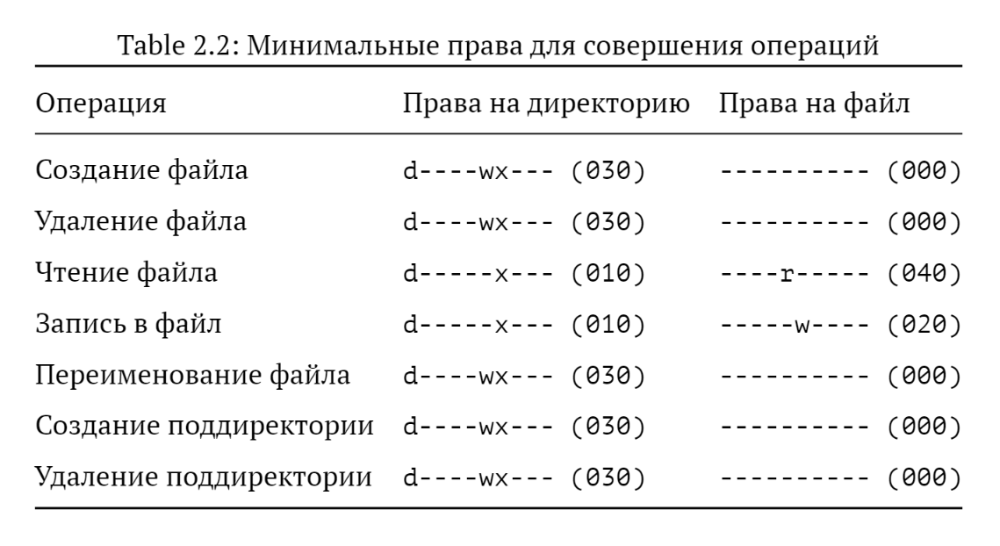

---
## Front matter
title: "Отчёт по лабораторной работе №03"
subtitle: "Дисциплина: Основы информационной безопасности"
author: "Баптишта Матеуж Андре НКАбд-01-23 "

## Generic otions
lang: ru-RU
toc-title: "Содержание"

## Bibliography
bibliography: bib/cite.bib
csl: pandoc/csl/gost-r-7-0-5-2008-numeric.csl

## Pdf output format
toc: true # Table of contents
toc-depth: 2
lof: true # List of figures
lot: true # List of tables
fontsize: 12pt
linestretch: 1.5
papersize: a4
documentclass: scrreprt
## I18n polyglossia
polyglossia-lang:
  name: russian
  options:
	- spelling=modern
	- babelshorthands=true
polyglossia-otherlangs:
  name: english
## I18n babel
babel-lang: russian
babel-otherlangs: english
## Fonts
mainfont: PT Serif
romanfont: PT Serif
sansfont: PT Sans
monofont: PT Mono
mainfontoptions: Ligatures=TeX
romanfontoptions: Ligatures=TeX
sansfontoptions: Ligatures=TeX,Scale=MatchLowercase
monofontoptions: Scale=MatchLowercase,Scale=0.9
## Biblatex
biblatex: true
biblio-style: "gost-numeric"
biblatexoptions:
  - parentracker=true
  - backend=biber
  - hyperref=auto
  - language=auto
  - autolang=other*
  - citestyle=gost-numeric
## Pandoc-crossref LaTeX customization
figureTitle: "Рис."
tableTitle: "Таблица"
listingTitle: "Листинг"
lofTitle: "Список иллюстраций"
lotTitle: "Список таблиц"
lolTitle: "Листинги"
## Misc options
indent: true
header-includes:
  - \usepackage{indentfirst}
  - \usepackage{float} # keep figures where there are in the text
  - \floatplacement{figure}{H} # keep figures where there are in the text
---

#  2.1 Цель работы

Получение практических навыков работы в консоли с атрибутами фай-
лов для групп пользователей.

# 2.2 Порядок выполнения работы

1. В предыдущей работе в установленной операционной системе создали учетную запись пользователя guest и задали пароль для пользователя (используя учетную запись администратора) 

{ #fig:001 width=70% height=70% }

2.	Аналогично создали второго пользователя guest2 и выполнили вход в эту учетную запись

{ #fig:002 width=70% height=70% }

3. Добавили пользователя guest2 в группу guest используя команду: gpasswd -a guest2 guest

{ #fig:003 width=70% height=70% }

4.	Выполнили вход в две учетные записи guest guest2 на разных консолях

{ #fig:004 width=70% height=70% }

5.	Для обоих пользователей командой Pwd определили директорию, в которой находимся. Сравнили ее с приглашением командой строки.

6.	Уточнили имя нашего пользователя, его группу, кто входит в нее и к каким группам принадлежит он сам. Определили командами groups guest и groups guest2, в какие группы входят пользователи guest и guest2. Сравнили выводы команды groups с выводом команд id –Gn и id –G.

{ #fig:005 width=70% height=70% }

7.	Сравнили полученную информацию с содержимым файла /etc/group. Посмотрели файл командой cat /etc/group.

{ #fig:006 width=70% height=70% }

8.	От имени пользователя guest2 выполнили регистрацию пользователя guest2 в группе guestкомандой newgrp guest

{ #fig:007 width=70% height=70% }

9.	От имени пользователя guest изменили права директории /home/guest, разрешив все действия для пользователей группы: chmod g+rwx /home/guest. И также от имени пользователя guest сняли с директории /home/guest/dir1 все атрибуты командой chmod 000 dirl и проверили правильность снятия атрибутов

{ #fig:008 width=70% height=70% }

Обозначения в таблице:

(1) Создание файла
(2) Удаление файла
(3) Запись в файл
(4) Чтение файла
(5) Смена директории
(6) Просмотр файлов в директории
(7) Переименование файл
(8) Смена атрибутов файла
 
: Установленные права и разрешённые действия для групп : Таблица 3.1

 { #fig:009 width=70% height=70% }
 
 10. Таблица 3.1
 { #fig:009 width=70% height=70% }
 
 : Минимальные права для совершения операций : Таблица 3.2
 
  { #fig:010 width=70% height=70% }

# Выводы

в этой лаборатории мы узнали, как получить практические навыки работы в консоли с атрибутами файлов для групп пользователей.

